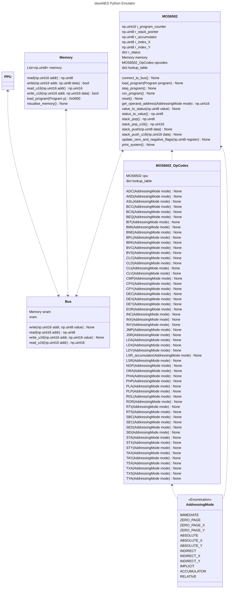

```mermaid
---
title: daveNES Python Emulator
---
classDiagram
    class MOS6502{
        %% attributes
        np.uint16 r_program_counter
        np.uint8 r_stack_pointer
        np.uint8 r_accumulator
        np.uint8 r_index_X
        np.uint8 r_index_Y
        dict r_status
        Memory memory
        MOS6502_OpCodes opcodes
        dict lookup_table
        
        %% methods
        connect_to_bus() None
        load_program(Program program) None
        step_program() None
        run_program() None
        reset() None
        get_operand_address(AddressingMode mode) np.uint16
        value_to_status(np.uint8 value) None
        status_to_value() np.uint8
        stack_pop() np.uint8
        stack_pop_u16() np.uint16
        stack_push(np.uint8 data) None
        stack_push_u16(np.uint16 data) None
        update_zero_and_negative_flags(np.uint8 register) None
        print_system() None

    }

    class Bus{
        %% attributes
        Memory wram
        vram

        %% methods
        write(np.uint16 addr, np.uint8 value) None
        read(np.uint16 addr) np.uint8
        write_u16(np.uint16 addr, np.uint16 value) None
        read_u16(np.uint16 addr) np.uint16
    }

    class PPU{
        %% Unimplemented Picture Processing Unit
    }

    class AddressingMode{
        <<Enumeration>>
        IMMEDIATE
        ZERO_PAGE
        ZERO_PAGE_X
        ZERO_PAGE_Y
        ABSOLUTE
        ABSOLUTE_X
        ABSOLUTE_Y
        INDIRECT
        INDIRECT_X
        INDIRECT_Y
        IMPLICIT
        ACCUMULATOR
        RELATIVE

    }

    class MOS6502_OpCodes{
        %% attributes
        MOS6502 cpu
        dict lookup_table

        %% methods
        ADC(AddressingMode mode) None
        AND(AddressingMode mode) None
        ASL(AddressingMode mode) None
        BCC(AddressingMode mode) None
        BCS(AddressingMode mode) None
        BEQ(AddressingMode mode) None
        BIT(AddressingMode mode) None
        BMI(AddressingMode mode) None
        BNE(AddressingMode mode) None
        BPL(AddressingMode mode) None
        BRK(AddressingMode mode) None
        BVC(AddressingMode mode) None
        BVS(AddressingMode mode) None
        CLC(AddressingMode mode) None
        CLD(AddressingMode mode) None
        CLI(AddressingMode mode) None
        CLV(AddressingMode mode) None
        CMP(AddressingMode mode) None
        CPX(AddressingMode mode) None
        CPY(AddressingMode mode) None
        DEC(AddressingMode mode) None
        DEX(AddressingMode mode) None
        DEY(AddressingMode mode) None
        EOR(AddressingMode mode) None
        INC(AddressingMode mode) None
        INX(AddressingMode mode) None
        INY(AddressingMode mode) None
        JMP(AddressingMode mode) None
        JSR(AddressingMode mode) None
        LDA(AddressingMode mode) None
        LDX(AddressingMode mode) None
        LDY(AddressingMode mode) None
        LSR_accumulator(AddressingMode mode) None
        LSR(AddressingMode mode) None
        NOP(AddressingMode mode) None
        ORA(AddressingMode mode) None
        PHA(AddressingMode mode) None
        PHP(AddressingMode mode) None
        PLA(AddressingMode mode) None
        PLP(AddressingMode mode) None
        ROL(AddressingMode mode) None
        ROR(AddressingMode mode) None
        RTI(AddressingMode mode) None
        RTS(AddressingMode mode) None
        SBC(AddressingMode mode) None
        SEC(AddressingMode mode) None
        SED(AddressingMode mode) None
        SEI(AddressingMode mode) None
        STA(AddressingMode mode) None
        STX(AddressingMode mode) None
        STY(AddressingMode mode) None
        TAX(AddressingMode mode) None
        TAY(AddressingMode mode) None
        TSX(AddressingMode mode) None
        TXA(AddressingMode mode) None
        TXS(AddressingMode mode) None
        TYA(AddressingMode mode) None
    }


    class Memory{
        %% attributes
        List~np.uint8~ memory

        %% methods
        read(np.uint16 addr) np.uint8
        write(np.uint16 addr, np.uint8 data) bool
        read_u16(np.uint16 addr) np.uint16
        write_u16(np.uint16 addr, np.uint16 data) bool
        load_program(Program p) 0x0600
        visualise_memory() None
    }


    %% Connecting Everything
    MOS6502 <..AddressingMode
    MOS6502_OpCodes <.. AddressingMode
    MOS6502 <..> Bus
    Memory <..> Bus
    PPU <..> Bus
    MOS6502 <.. MOS6502_OpCodes
```